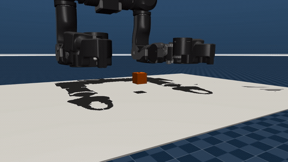
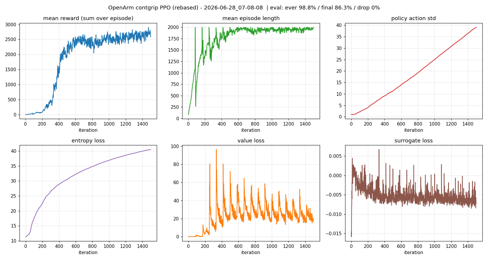
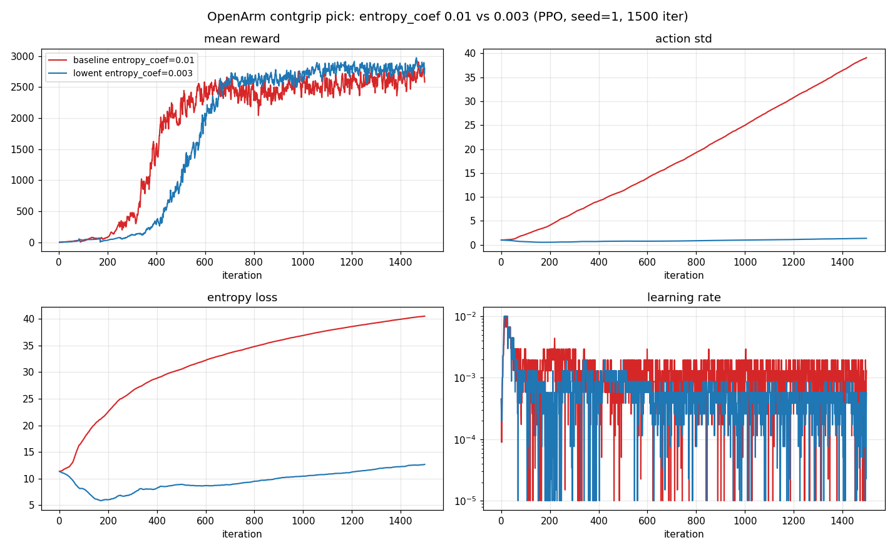
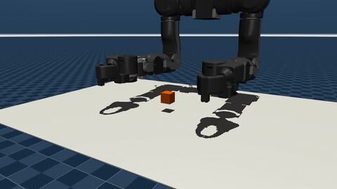

# 当机械臂自己发明了一种抓法：在 UniLab 上做 OpenArm 抓取的强化学习实践

> When a Robot Arm Invents Its Own Grip: A Reinforcement Learning Practice on UniLab

**语言 / Language:** [中文](#中文) · [English](#english) ·  📄 技术详解版 / Deep-dive

> ⚡ 只想 3 分钟快速了解？ → [**精简版 / Concise digest**](README.md)

> TL;DR：我们在 [UniLab](https://github.com/unilabsim/UniLab) 框架上，用 PPO 给
> OpenArm 单臂训练了一个"把方块抬到空中目标点"的抓取策略。过程中遇到三个有意思的
> 节点：(1) 连续夹爪比一键开合难学得多；(2) 策略没有按我们设想去"夹紧"，而是学出了
> 一种稳定的"开指托举"；(3) 训练成功率早就封顶，但有一条曲线一路失控涨到 39——最后
> 我们用一个超参把它压回 1.35，曲线变干净，成功率还略升。最终：确定性评估 ever
> success 100%、final success 87.9%、掉落率 0%。


🎬 完整视频（高清）：[总览](assets/videos/play_overview.mp4) · [上方特写](assets/videos/play_closeup_top.mp4) · [左臂右前方特写](assets/videos/play_closeup_leftfront.mp4)

---

## 中文

### 0. 平台与框架：UniLab × AMD ROCm

先交代这次实践站在什么平台、用什么框架上。

[UniLab](https://github.com/unilabsim/UniLab) 是一个开源机器人强化学习框架，它的设计
理念可以概括为一句话——**"在 GPU 主导范式之外做机器人 RL"**（A Heterogeneous
Architecture for Robot RL Beyond GPU-Dominant Paradigms）。它最大的特点是 **CPU 仿真 +
GPU 训练**的异构分工：

```
┌───────────────────┐                            ┌─────────────────────────┐
│   CPU 物理仿真     │       统一共享内存          │     GPU 策略训练         │
│   MuJoCo/Motrix   │ ─────────────────────────▶ │     PPO / SAC / TD3      │
│   多线程并行步进   │   SharedReplayBuffer        │  CUDA / MPS / ROCm / XPU │
└───────────────────┘                            └─────────────────────────┘
```

- **CPU 跑物理**：MuJoCo / MotrixSim 在 CPU 上多线程并行步进大量环境；
- **GPU 跑学习**：transition 经**共享内存**流式喂给 GPU 上的 PPO / SAC / TD3 学习器。

这样不依赖 GPU 物理后端，也能用大规模并行仿真的吞吐喂满 GPU 学习器。再配合两套物理
后端、统一训练 CLI（`uv run train` / `uv run eval`）和 Hydra owner YAML 配置驱动，
做大量对照实验非常顺手——这正是后面我们调参方式的底座。

本次实践跑在 **AMD 平台**上：**AMD Instinct MI300X / MI210 GPU + ROCm**。UniLab 把
ROCm 作为一等支持的目标平台，一条命令即可切到 ROCm 依赖来安装环境：

```bash
make sync-rocm   # 切到 pyproject.rocm.toml，安装 ROCm 版依赖
```

之后用 `HIP_VISIBLE_DEVICES` 指定 GPU 卡即可（下文复现命令里就是这么用的）。

### 1. 我们想做什么

目标很朴素：让 OpenArm 的一条手臂把桌面上的一个 3cm 方块抓起来、抬到空中的一个目标
点并稳定保持。我们把右臂和升降机构固定，让策略只控制左臂的 7 个关节加一个夹爪——
这样问题边界清晰，便于聚焦"抓取"本身。

为什么用 UniLab？三个词：**模块化、配置驱动、多后端(ROCm/CUDA/MLX)**。任务、reward、后端都通过
Hydra 配置 + registry 表达，算法超参直接走 YAML，不在 Python 里硬编码业务规则。这让
"换一个想法 = 改一处配置"，非常适合做大量对照实验——后面你会看到，这一点直接决定了
我们调参的方式。

### 2. 第一版：先让它"动起来"

最初的形态是经典的 `reach → lift → goal` 稠密塑形 + binary（一键）夹爪。第一版很快
撞上一个经典局部最优：**夹住了却不抬**——策略发现把爪子贴在方块上就能拿到 reach/grasp
的奖励，于是赖在原地不动。

我们的修正是给"抬升"加一个**邻近度门控（proximity-gated dense lift）**：只有当末端
真正贴近方块时，抬升奖励才生效；同时把目标改成空中 3D 点，逼着策略离开"贴着方块不动"
的舒适区。这是 reward shaping 的典型一课：你以为在奖励"抓取"，其实在奖励"贴近"。

### 3. 难点升级：会"捏"的夹爪

binary 夹爪是作弊版——一个信号瞬间闭合。真实世界里夹爪是**连续**控制的，闭合需要时间、
力、时机。于是我们做了 `lift3d_contgrip` 变体，把夹爪交给策略连续控制，并设计了
**分阶段抓取塑形**：

- `approach`：鼓励先把张开的夹爪移到方块上方（先到位再动手）；
- `premature_close`：轻罚"离方块还远就闭合"（别乱夹）；
- `action_rate`：动作平滑惩罚（别抖）；
- `firm_grasp`：只有在方块被抬起、末端在方块上时才发放（边搬边握）；
- 关键一招 `terminate_on_success=false`：成功后不结束 episode，让策略持续被"付费保持"，
  否则一成功就松手、方块立刻滑落。

这些项合起来，让抓取从"一把横扫"变成了分段动作：**上方张开 → 下探 → 闭合 → 抬起**。

能看清夹爪接近与闭合的细节：



🎬 完整视频（高清）：[play_closeup_leftfront.mp4](assets/videos/play_closeup_leftfront.mp4)

### 4. 惊喜：它学会了"托"，而不是"夹" 🌟

训完一看评估，出现一个反直觉的现象：

```
grasp firmness : mean finger closure on held envs = 0.000  (0=open..1=closed)
ever closed    : 0.8%
ever success   : 100.0%
```

策略**几乎从不闭合手指**（闭合度 ≈ 0），却能 100% 把方块抬起来。它学到的不是"夹"，
而是用两根指尖把方块**兜住、托起**——一种 open fingertip-cradle。

一开始我们以为是 bug，仔细想才明白：对这个**高摩擦、小尺寸**的方块几何，开指托举其实
是更鲁棒的最优解。夹紧需要精确的对中和力控，稍有偏差就打飞方块；而指尖托举靠的是几何
兜底 + 摩擦，容错大得多。我们越想"逼"它夹紧（加大 firm_grasp），主目标（抬到目标点）
反而越差。

这是强化学习最迷人的地方之一：**它不解你出的题，它解它自己发现的、更好解的那道题。**
作为工程师，正确的反应不是"修正"它，而是先问一句——它是不是发现了我没想到的更优解？


### 5. 看懂训练曲线：一条失控的线 🌟

策略能用了，但训练曲线里藏着一个怪现象。reward 和成功率在 iter ~600 就基本封顶，可有
一条线——`action std`——却从此一路单调上涨，到 1500 iter 时飙到了 **39**。

先解释 `action std` 是什么。PPO 的策略不是直接输出一个确定动作，而是输出一个高斯分布：
均值 `mean`（想做的动作）+ 标准差 `std`（探索噪声的大小）。训练时从分布里采样以便探索，
**评估时只用 `mean`**。所以 `std` 涨到 39，并不影响确定性评估的成功率——这也是为什么
我们一开始没注意到。

那它为什么会失控？PPO 损失里有个**熵奖励**（`entropy_coef` 控制权重），鼓励策略保持
随机以防过早收敛；对高斯分布，`std` 越大熵越大、熵奖励越多。正常情况下增大 `std` 会让
动作变乱、reward 下降，于是有平衡点。但我们这个任务的动作经过 `action_scale` + tanh
**饱和压缩**：一旦 `mean` 已经把任务解好，再大的 pre-squash `std` 经 tanh 压缩后几乎不
改变真正执行的动作，reward 不掉。于是 PPO 发现了一个"免费午餐"：

> 把 `std` 推大 → 白拿熵奖励，reward 不受惩罚 → 那就一直推。

结果 `action std` 和 `entropy` 一路爬升，纯属薅熵奖励的羊毛。它对控制无害，但让训练
曲线很难看，也掩盖了"策略其实早就收敛了"这个事实。



### 6. 一个超参的因果：把曲线调干净 🌟

诊断清楚了，修正就很自然：**削弱那个"免费熵奖励"的动机**。我们做了一个干净的对照
实验——其它一切不变（同 seed、同 4096 env × 24 steps × 1500 iter），只把
`entropy_coef` 从 `0.01` 降到 `0.003`。

结果非常清楚：

| 指标 | baseline `0.01` | lowent `0.003` |
| --- | --- | --- |
| ever success（512-env 确定性 eval） | 98.8% | **100.0%** |
| final success | 86.3% | **87.9%** |
| drop rate | 0% | 0% |
| 最终 reward | 2580 | **2800** |
| 最终 `action std` | 39.08 | **1.35** |
| 最终 `entropy loss` | ~40（单调爬升） | **~12（平稳）** |



这不是"用成功率换干净曲线"的取舍，而是**净改进**：去掉一个对控制无益的训练副产物之后，
曲线干净了，确定性成功率还略升、reward 还略高。唯一代价是到平台期约晚 ~150 iter（早期
探索噪声变小了一点）。

值得一提的是**怎么固化这个改动**：我们没有去改 Python，而是新增一个 owner 变体 YAML
（`mujoco_lift3d_contgrip_lowent.yaml`，只覆盖一个字段），继承原 contgrip 的全部任务/
reward。这正是 UniLab "配置优先、在 owner 层修正"的体现——改动可追溯、可对照、可回滚。

```yaml
# assets/code/mujoco_lift3d_contgrip_lowent.yaml（节选）
defaults:
  - /task/openarm_demo_pick/mujoco_lift3d_contgrip
  - _self_
algo:
  algorithm:
    entropy_coef: 0.003
```

### 7. 脚本 vs 学习：两种抓法对照

为了有个"标准答案"做参照，我们还写了一个**非 RL 的脚本化 pick**：用左臂 Jacobian 做
阻尼最小二乘 IK，按 `APPROACH → DESCEND → CLOSE → LIFT` 分阶段执行，走与策略相同的回放
管线。它不需要 checkpoint，能产出干净的对照演示，也方便回答"策略到底比脚本好在哪/差在
哪"。

顺带，我们增强了可视化系统：可隐藏遮挡网格（`hide_geom_groups`）、控制慢动作
（`video_fps`）、渲染单 env 特写、自定义相机位姿——上面那些特写视频就是这么来的。



🎬 完整视频（高清）：[上方特写](assets/videos/play_closeup_top.mp4) · [左臂右前方特写](assets/videos/play_closeup_leftfront.mp4)

### 8. 自己动手复现

训练（无渲染）：

```bash
uv run train --algo ppo --task openarm_demo_pick --sim mujoco \
  --profile lift3d_contgrip_lowent training.no_play=true
```

确定性评估（512 env）：

```bash
HIP_VISIBLE_DEVICES=0 uv run scripts/eval_openarm_success.py \
  task=openarm_demo_pick/mujoco_lift3d_contgrip_lowent \
  algo.load_run=logs/rsl_rl_ppo/OpenArmDemoPick/<run>_mujoco \
  +training.eval_envs=512 training.play_steps=200
```

夹爪闭合特写视频（单 env、左臂右前方低机位）：

```bash
MUJOCO_GL=egl HIP_VISIBLE_DEVICES=0 uv run eval --algo ppo --task openarm_demo_pick \
  --sim mujoco --profile lift3d_contgrip_lowent \
  algo.load_run=logs/rsl_rl_ppo/OpenArmDemoPick/<run>_mujoco \
  training.play_env_num=1 training.play_steps=260 training.play_video_fps=8 \
  training.cam_distance=0.55 training.cam_elevation=-8.0 training.cam_azimuth=150.0 \
  "training.cam_lookat=[0.46,0.0,1.04]"
```

相关：UniLab PR [#640](https://github.com/unilabsim/UniLab/pull/640)。

### 9. 收获与下一步

三条贯穿全程的方法论：

1. **配置优先**：把"想法"表达成配置而非代码，让对照实验变得廉价、可追溯。
2. **在最接近风险处验证**：成功率没退化不代表万事大吉——盯住每一条曲线。
3. **让证据说话**：策略学出"开指托举"不是 bug，是它给出的证据，先理解再判断。

下一步：跑多 seed 做统计置信、上 Motrix 后端验证 sim2sim、尝试真正的"夹紧"抓取、
以及泛化到更多物体几何。

> 训练规模：4096 并行环境 × 每 iter 24 步 × 1500 iter ≈ **1.47 亿步**仿真，
> 单次约 1h49m（共享 GPU，吞吐 ~23k steps/s）。

---

## English

> TL;DR: On the [UniLab](https://github.com/unilabsim/UniLab) framework we trained
> a PPO policy for a single OpenArm to pick up a cube and hold it at an in-air
> goal. Three interesting moments along the way: (1) a continuous gripper is much
> harder to learn than a binary snap-close; (2) the policy did not "clamp" as we
> intended — it invented a stable *open fingertip-cradle*; (3) success plateaued
> early, yet one curve drifted out of control up to 39 — we pulled it back to 1.35
> with a single hyperparameter, cleaning the curves while slightly *improving*
> success. Final deterministic eval: ever-success 100%, final-success 87.9%, drop
> rate 0%.


🎬 Full videos (HD): [overview](assets/videos/play_overview.mp4) · [top close-up](assets/videos/play_closeup_top.mp4) · [left-arm right-front close-up](assets/videos/play_closeup_leftfront.mp4)

### 0. Platform & Framework: UniLab × AMD ROCm

First, what platform and framework this practice stands on.

[UniLab](https://github.com/unilabsim/UniLab) is an open-source robot RL framework
whose design philosophy fits in one line — **"robot RL beyond the GPU-dominant
paradigm"** (A Heterogeneous Architecture for Robot RL Beyond GPU-Dominant
Paradigms). Its defining trait is a **CPU-sim + GPU-training** heterogeneous split:

```
┌───────────────────┐                            ┌─────────────────────────┐
│  CPU Physics Sim  │   Unified Shared Memory    │   GPU Policy Training    │
│   MuJoCo/Motrix   │ ─────────────────────────▶ │     PPO / SAC / TD3      │
│ Multithread Step  │    SharedReplayBuffer       │ CUDA / MPS / ROCm / XPU  │
└───────────────────┘                            └─────────────────────────┘
```

- **CPU does physics**: MuJoCo / MotrixSim step many environments in parallel on CPU;
- **GPU does learning**: transitions stream through **shared memory** into a
  PPO / SAC / TD3 learner on the GPU.

So you can saturate a GPU learner with high-throughput massively-parallel
simulation *without* needing a GPU physics backend. Add two physics backends, a
unified training CLI (`uv run train` / `uv run eval`), and Hydra owner-YAML
config-driven tasks, and large batches of controlled experiments become easy —
which is exactly the foundation for how we tuned things later.

This practice runs on an **AMD platform**: **AMD Instinct MI300X / MI210 GPUs +
ROCm**. UniLab treats ROCm as a first-class target — one command switches to the
ROCm dependency set to install the environment:

```bash
make sync-rocm   # switch to pyproject.rocm.toml and install ROCm deps
```

After that, pick a GPU with `HIP_VISIBLE_DEVICES` (as the reproduce commands below do).

### 1. What We Set Out to Do

The goal is simple: have one OpenArm arm pick a 3 cm cube off the table, lift it
to an in-air goal, and hold it there. We freeze the right arm and the lifter so
the policy only controls the left arm's 7 joints plus one gripper — a clean
boundary that lets us focus on grasping itself.

Why UniLab? Three words: **modular, config-driven, multi-backend (ROCm/CUDA/MLX)**. Tasks,
rewards, and backends are expressed through Hydra config + a registry; algorithm
hyperparameters live in YAML rather than hard-coded in Python. "A new idea = a
config change" makes large batches of controlled experiments cheap — which, as
you'll see, directly shaped how we tuned things.

### 2. First Version: Make It Move

We started with the classic `reach → lift → goal` dense shaping and a binary
(snap-close) gripper. It promptly hit a classic local optimum: **grab but never
lift** — the policy learned that parking the jaws on the cube already collects the
reach/grasp reward, so it just sat there.

The fix was a **proximity-gated dense lift**: the lift reward only kicks in once
the end-effector is genuinely close to the cube, plus an in-air 3D goal to force
the policy out of the "sit on the cube" comfort zone. A classic shaping lesson:
you think you're rewarding "grasping," but you're actually rewarding "getting
close."

### 3. Harder: A Gripper That Actually Closes

A binary gripper is the easy mode — one signal, instant close. Real grippers are
**continuous**: closing takes time, force, timing. So we built the
`lift3d_contgrip` variant, handing continuous gripper control to the policy with
a **staged grasp shaping**:

- `approach`: encourage moving the *open* gripper above the cube first;
- `premature_close`: mildly penalize closing while still far from the cube;
- `action_rate`: smoothness penalty;
- `firm_grasp`: paid only once the cube is lifted and the TCP is on it;
- the key trick `terminate_on_success=false`: don't end the episode on success,
  so the policy is continuously *paid to hold* — otherwise it lets go the instant
  it succeeds and the cube slips.

Together these turn the pick from a single swipe into a segmented motion:
**open-above → descend → close → lift**.

The approach and closing in detail:


🎬 Full video (HD): [play_closeup_leftfront.mp4](assets/videos/play_closeup_leftfront.mp4)

### 4. The Surprise: It Learned to Cradle, Not Clamp 🌟

Evaluation revealed something counter-intuitive:

```
grasp firmness : mean finger closure on held envs = 0.000  (0=open..1=closed)
ever closed    : 0.8%
ever success   : 100.0%
```

The policy **almost never closes its fingers** (closure ≈ 0), yet lifts the cube
100% of the time. It learned not to *clamp* but to *cradle* — holding the cube
between two fingertips, an open fingertip-cradle.

We first assumed a bug. Then it clicked: for this **high-friction, small-cube**
geometry, the open cradle is the more robust optimum. Clamping needs precise
centering and force control; a small error flicks the cube away. A fingertip
cradle leans on geometry + friction and is far more forgiving. The harder we
tried to *force* clamping (raising `firm_grasp`), the worse the primary objective
got.

This is one of RL's most fascinating traits: **it doesn't solve the problem you
posed — it solves the easier, better problem it discovered.** The right engineer
reflex isn't to "correct" it, but to first ask: did it find a better solution I
hadn't imagined?


### 5. Reading the Curves: One Line Goes Wild 🌟

The policy worked, but the training curves hid an oddity. Reward and success
plateaued around iter ~600, yet one line — `action std` — kept climbing
monotonically, reaching **39** by iter 1500.

First, what is `action std`? A PPO policy outputs not a deterministic action but a
Gaussian: a `mean` (the intended action) plus a `std` (exploration noise). During
training it samples for exploration; **at eval it uses only the `mean`**. So a
`std` of 39 doesn't affect deterministic success — which is why we missed it at
first.

Why does it blow up? PPO's loss has an **entropy bonus** (weighted by
`entropy_coef`) that rewards staying random to avoid premature convergence; for a
Gaussian, larger `std` means more entropy, means more bonus. Normally larger
`std` makes actions noisier and reward drops, so there's a balance point. But our
actions pass through `action_scale` + tanh **saturation**: once the `mean` already
solves the task, an enormous pre-squash `std` barely changes the executed action
after tanh, so reward doesn't drop. PPO found a free lunch:

> Inflate `std` → free entropy bonus, no reward penalty → so keep inflating.

The result: `action std` and `entropy` climb forever, pure free-entropy farming.
Harmless to control, but it makes the curves ugly and masks the fact that the
policy converged long ago.


### 6. One Hyperparameter, Cleaner Results 🌟

With the diagnosis clear, the fix is natural: **weaken the free-entropy
incentive**. We ran a clean controlled experiment — everything fixed (same seed,
same 4096 env × 24 steps × 1500 iter), only `entropy_coef` lowered from `0.01` to
`0.003`.

| Metric | baseline `0.01` | lowent `0.003` |
| --- | --- | --- |
| ever success (512-env deterministic eval) | 98.8% | **100.0%** |
| final success | 86.3% | **87.9%** |
| drop rate | 0% | 0% |
| final reward | 2580 | **2800** |
| final `action std` | 39.08 | **1.35** |
| final `entropy loss` | ~40 (monotonic) | **~12 (flat)** |


This isn't a "trade success for clean curves" deal — it's a **net win**: remove a
useless training byproduct and the curves clean up while deterministic success
*improves* slightly and reward is higher. The only cost: reaching the plateau
~150 iter later (slightly less early exploration).

Worth noting *how* we locked it in: not by touching Python, but by adding an owner
variant YAML (`mujoco_lift3d_contgrip_lowent.yaml`) that overrides a single field
and inherits the rest of contgrip. This is UniLab's "config-first, fix-at-owner-
layer" principle in action — traceable, comparable, revertible.

```yaml
# assets/code/mujoco_lift3d_contgrip_lowent.yaml (excerpt)
defaults:
  - /task/openarm_demo_pick/mujoco_lift3d_contgrip
  - _self_
algo:
  algorithm:
    entropy_coef: 0.003
```

### 7. Scripted vs Learned

For a "ground truth" reference we also wrote a **non-RL scripted pick**: damped
least-squares IK from the left-arm Jacobian, executed in stages
(`APPROACH → DESCEND → CLOSE → LIFT`) through the same playback pipeline. It needs
no checkpoint, gives clean reference demos, and helps answer "where exactly is the
policy better/worse than the script."

Along the way we extended the visualization system: hide occluding meshes
(`hide_geom_groups`), control slow-motion (`video_fps`), render single-env
close-ups, and set custom camera poses — which is how the close-up clips above
were made.


🎬 Full videos (HD): [top close-up](assets/videos/play_closeup_top.mp4) · [left-arm right-front close-up](assets/videos/play_closeup_leftfront.mp4)

### 8. Reproduce It Yourself

Train (no rendering):

```bash
uv run train --algo ppo --task openarm_demo_pick --sim mujoco \
  --profile lift3d_contgrip_lowent training.no_play=true
```

Deterministic eval (512 envs):

```bash
HIP_VISIBLE_DEVICES=0 uv run scripts/eval_openarm_success.py \
  task=openarm_demo_pick/mujoco_lift3d_contgrip_lowent \
  algo.load_run=logs/rsl_rl_ppo/OpenArmDemoPick/<run>_mujoco \
  +training.eval_envs=512 training.play_steps=200
```

Gripper close-up video (single env, left-arm right-front low angle):

```bash
MUJOCO_GL=egl HIP_VISIBLE_DEVICES=0 uv run eval --algo ppo --task openarm_demo_pick \
  --sim mujoco --profile lift3d_contgrip_lowent \
  algo.load_run=logs/rsl_rl_ppo/OpenArmDemoPick/<run>_mujoco \
  training.play_env_num=1 training.play_steps=260 training.play_video_fps=8 \
  training.cam_distance=0.55 training.cam_elevation=-8.0 training.cam_azimuth=150.0 \
  "training.cam_lookat=[0.46,0.0,1.04]"
```

See also: UniLab PR [#640](https://github.com/unilabsim/UniLab/pull/640).

### 9. Takeaways & What's Next

Three principles that ran through the whole thing:

1. **Config first**: express ideas as config, not code — controlled experiments
   become cheap and traceable.
2. **Validate near the risk**: "success didn't drop" isn't all-clear — watch every
   curve.
3. **Let evidence speak**: the open-cradle grasp wasn't a bug, it was evidence —
   understand before you judge.

Next: multi-seed statistics for confidence, validate sim2sim on the Motrix
backend, attempt a true clamping grasp, and generalize to more object geometries.

> Training scale: 4096 parallel envs × 24 steps/iter × 1500 iter ≈ **147.5M**
> simulation steps, ~1h49m per run (shared GPU, ~23k steps/s).
