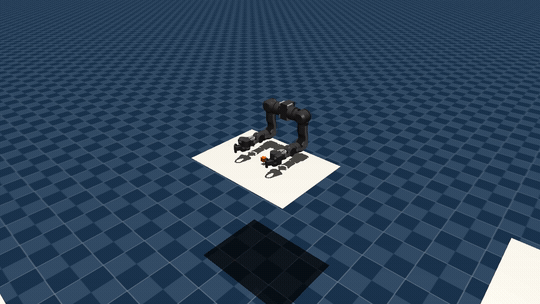
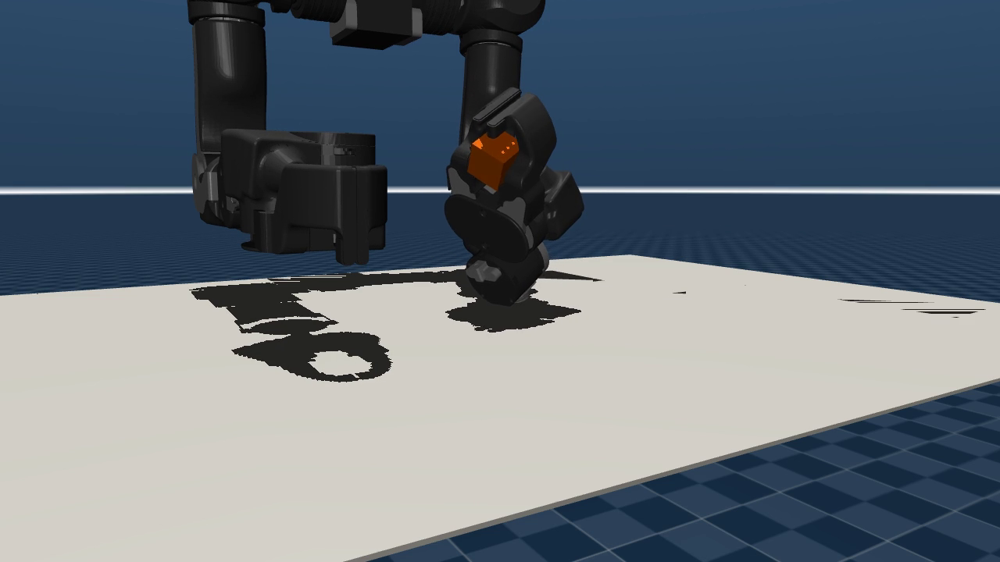

# 当机械臂自己发明了一种抓法：OpenArm 抓取强化学习实践

> When a Robot Arm Invents Its Own Grip: An RL Practice with OpenArm

**语言 / Language:** [中文](#中文) · [English](#english) ·  ⏱️ ~3 min read

> 📖 想看完整工程细节（reward 设计、训练曲线诊断、复现命令）？ → [**技术详解版 / Deep-dive**](README-details.md)

---

## 中文

### 概要

我们在开源机器人 RL 框架 [UniLab](https://github.com/unilabsim/UniLab) 上，用 PPO 给
**OpenArm** 的一条手臂训练了一个抓取策略：把桌面上的 3cm 方块抓起、抬到空中目标点并稳稳
保持。整条链路跑在 **AMD Instinct MI300X / MI210 + ROCm** 上——UniLab 采用 **CPU 仿真 +
GPU 训练**的异构架构，把 ROCm 作为一等平台，`make sync-rocm` 一条命令即可装好环境。

最终确定性评估：**ever success 100%、final success 87.9%、掉落率 0%**。但真正有意思的
是过程里的三个瞬间。

### 三个有意思的瞬间

**1. 会"捏"的夹爪比想象中难。** 一键开合（binary）的夹爪是作弊版；换成**连续控制**后，
策略最初总在"夹住却不抬"的局部最优里打转。我们用分阶段塑形（先到方块上方→下探→闭合→
抬起）+ 一招 `terminate_on_success=false`（成功后不结束、持续"付费保持"）才让它学会完整
动作。

**2. 它学会了"托"，而不是"夹"。** 🌟 评估时发现策略**几乎从不闭合手指**（闭合度≈0），
却能 100% 抬起方块——它用两根指尖把方块**兜住托起**。一开始以为是 bug，后来才懂：对这个
高摩擦、小尺寸的方块，指尖托举靠几何兜底 + 摩擦，比精确夹紧**更鲁棒**。我们越逼它夹紧，
主目标反而越差。RL 最迷人之处：**它不解你出的题，而是解它发现的、更好解的那道题。**

**3. 一条失控的曲线，被一个超参救回。** 🌟 成功率在 ~600 iter 就封顶，但 `action std`
一路涨到 **39**。原因：动作经 tanh 饱和压缩后，把探索噪声推大几乎不改变真正执行的动作，
于是 PPO 发现了"薅熵奖励的免费午餐"——把 std 推大白拿熵奖励、reward 不掉。它对控制无害，
却让曲线难看、掩盖了"其实早已收敛"。诊断清楚后，只把 `entropy_coef` 从 `0.01` 降到
`0.003`（其它全不变），曲线立刻变干净：

| 指标 | baseline `0.01` | lowent `0.003` |
| --- | --- | --- |
| ever success | 98.8% | **100.0%** |
| final success | 86.3% | **87.9%** |
| 最终 reward | 2580 | **2800** |
| 最终 action std | 39.08 | **1.35** |

这不是"用成功率换干净曲线"，而是**净改进**。而且改动没碰 Python——只新增一个覆盖单字段的
owner 变体 YAML，体现 UniLab "配置优先、在 owner 层修正"的理念（可追溯、可对照、可回滚）。

### 三条方法论

1. **配置优先**：把想法表达成配置而非代码，让对照实验廉价、可追溯。
2. **在最接近风险处验证**：成功率没退化 ≠ 万事大吉，盯住每一条曲线。
3. **让证据说话**：反直觉现象往往是策略给的证据，先理解再判断。

> 训练规模：4096 并行环境 × 24 步/iter × 1500 iter ≈ **1.47 亿步**仿真，单次约 1h49m
> （共享 GPU，~23k steps/s）。想复现、看完整 reward/曲线分析 → [技术详解版](README-details.md)。
> 相关：UniLab PR [#640](https://github.com/unilabsim/UniLab/pull/640)。

---

## English

### Overview

On the open-source robot-RL framework [UniLab](https://github.com/unilabsim/UniLab)
we trained a PPO grasp policy for a single **OpenArm**: pick a 3 cm cube off the
table, lift it to an in-air goal, and hold it. The whole pipeline runs on **AMD
Instinct MI300X / MI210 + ROCm** — UniLab uses a **CPU-sim + GPU-training**
heterogeneous architecture and treats ROCm as first-class (`make sync-rocm` sets
up the environment in one command).

Final deterministic eval: **ever-success 100%, final-success 87.9%, drop rate 0%**.
But the interesting part is three moments along the way.

### Three interesting moments

**1. A gripper that actually closes is hard.** A binary snap-close gripper is easy
mode; switching to **continuous** control, the policy kept getting stuck in a
"grab but never lift" local optimum. Staged shaping (open-above → descend → close →
lift) plus one trick — `terminate_on_success=false` (don't end on success, keep
*paying it to hold*) — finally taught it the full motion.

**2. It learned to cradle, not clamp.** 🌟 At eval the policy **almost never closes
its fingers** (closure ≈ 0), yet lifts the cube 100% of the time — it *cradles* the
cube between two fingertips. We assumed a bug; then it clicked: for this
high-friction, small cube, a fingertip cradle leans on geometry + friction and is
**more robust** than precise clamping. The harder we forced clamping, the worse the
primary objective got. RL's most fascinating trait: **it doesn't solve the problem
you posed — it solves the easier, better one it discovered.**

**3. One wild curve, saved by one hyperparameter.** 🌟 Success plateaued around
iter ~600, but `action std` climbed to **39**. Why: after tanh saturation,
inflating the exploration noise barely changes the executed action, so PPO found a
"free entropy lunch" — inflate std, collect entropy bonus, reward doesn't drop.
Harmless to control, but it makes curves ugly and hides that the policy converged
long ago. The fix: lower `entropy_coef` from `0.01` to `0.003` (nothing else
changed):

| Metric | baseline `0.01` | lowent `0.003` |
| --- | --- | --- |
| ever success | 98.8% | **100.0%** |
| final success | 86.3% | **87.9%** |
| final reward | 2580 | **2800** |
| final action std | 39.08 | **1.35** |

Not a "trade success for clean curves" deal — a **net win**. And the change touched
no Python: just a new owner-variant YAML overriding a single field — UniLab's
"config-first, fix-at-owner-layer" principle (traceable, comparable, revertible).

### Three takeaways

1. **Config first**: express ideas as config, not code — cheap, traceable experiments.
2. **Validate near the risk**: "success didn't drop" isn't all-clear — watch every curve.
3. **Let evidence speak**: a counter-intuitive result is often evidence — understand before you judge.

> Training scale: 4096 parallel envs × 24 steps/iter × 1500 iter ≈ **147.5M** sim
> steps, ~1h49m per run (shared GPU, ~23k steps/s). To reproduce and see the full
> reward/curve analysis → [deep-dive](README-details.md).
> See also: UniLab PR [#640](https://github.com/unilabsim/UniLab/pull/640).
