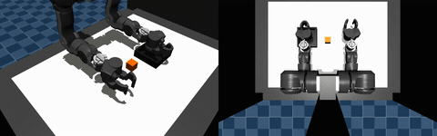
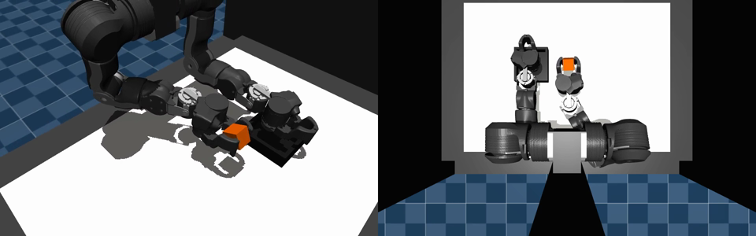
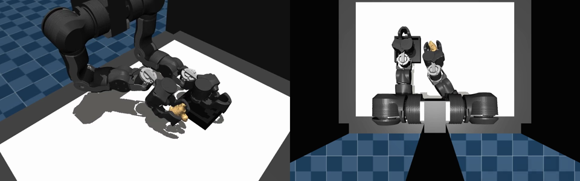
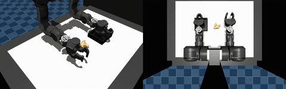

# 给 VLA 喂饭：在 AMD ROCm 上用 OpenArm 生成抓取专家轨迹

> Feeding the VLA: Generating Expert Grasp Trajectories for OpenArm on AMD ROCm

**语言 / Language:** [中文](#中文) · [English](#english) ·  📄 技术详解版 / Deep-dive

> ⚡ 只想 3 分钟快速了解？ → [**精简版 / Concise digest**](README.md)

> TL;DR：我们在 **AMD Instinct MI300X + ROCm** 平台上，跑通了 [`openarm_mp_labs`](https://github.com/alexhegit/openarm_mp_labs)
> 的 OpenArm 抓-放轨迹生成：用 Cartesian 路点 + mink IK 把一次抓取拆成
> `approach → descend → close → lift → transport → place → retreat → home`，IK 末端
> 误差 0.4–0.9 mm，cube / ginger 物理仿真抬升 112–120 mm。抓取位姿既可以是标定的
> top-down，也可以来自 **GraspGenX 的 6-DOF 抓取**（在 AMD ROCm 上跑、为 OpenArm 夹爪
> 生成，靠我提的 3 个 GraspGenX PR 落地）。核心价值：这是一台 **sim 内的「专家轨迹数据
> 引擎」**，为后续 **VLA 模型**训练批量产出可复现的示范数据——而整条链路跑在 AMD ROCm 上。



---

## 中文

### 0. 平台与框架：AMD MI300X + ROCm

先交代平台。这次实践完全跑在 **AMD Instinct MI300X + ROCm** 机器上：

- **硬件**：AMD Instinct **MI300X**。
- **ROCm 栈**：基于`rocm/pytorch:rocm7.2_ubuntu24.04_py3.12_pytorch_release_2.7.1`
  容器里实测。
- **主项目**：[`openarm_mp_labs`](https://github.com/alexhegit/openarm_mp_labs)——OpenArm 的
  manipulation labs，做 MuJoCo 抓-放**轨迹生成与回放**。
- **依赖**：[`openarm_mujoco`](https://github.com/enactic/openarm_mujoco)（场景/模型）、
  [`openarm_control`](https://github.com/enactic/openarm_control)（运动学/IK）、
  [`GraspGenX`](https://github.com/NVlabs/GraspGenX)（6-DOF 抓取生成）、
  [`Scan2Sim`](https://github.com/alexhegit/Scan2Sim)（把真实扫描件转成 MuJoCo 资产）。


> 说明：抓取动作由AMD/ROCm驱动**GraspGenX 生成抓取姿势**和**轨迹生成(MuJoCo IK物理计算)** 两阶段构成了合成数据。
> 本文把"轨迹数据生成"定位为这条**仿真环境动作轨迹数据+VLA训练**流水线的**上游数据引擎**，ROCm 是支撑整条链路的平台。


### 1. 我们想做什么

一句话：**为 OpenArm 在仿真里批量生成「抓-放」专家轨迹**，让它能成为未来 **VLA（Vision-
Language-Action）模型**训练的示范数据来源。

为什么是"轨迹生成"而不是"训练一个策略"？因为 VLA 这类模型吃的是**大量高质量示范**
（observation–action 序列）。与其昂贵地真机采集，不如先在 sim 里用**确定性、可复现、可
批量**的方式造数据：给定物体与抓取位姿，自动解出一条平滑、物理可行的抓-放轨迹。这正是
`openarm_mp_labs` 做的事。

### 2. 管线总览

整条链路三段：

```
GraspGenX 6-DOF 抓取(可选)         Cartesian 路点 + mink IK            MuJoCo 物理回放/录制
   gripper=openarm        ─────▶   approach→...→home       ─────▶    lift 校验 + MP4
   (AMD ROCm 上生成)                (openarm_control)                  (openarm_mujoco)
```

- **抓取位姿**：要么用标定的 top-down 垂直抓取，要么读 GraspGenX 的 `isaac_grasp` YAML，
  用其 6-DOF 朝向驱动末端姿态；
- **轨迹生成**：把抓取点 + 放置点展开成一串笛卡尔路点，逐点用 mink 阻尼最小二乘 IK 解出
  16 维双臂关节角（右臂动、左臂钉在 home）；
- **物理回放**：在 MuJoCo 里按轨迹驱动，校验方块是否真被抬起（>30 mm 判通过），并离屏
  录制 MP4。

### 3. 轨迹是怎么生成的

核心在 `trajectory.py`。一次抓-放被拆成带 `*_refine` 收敛步的多个阶段：

```
home → approach(25) → descend_grasp(18) → close_gripper(24) → lift(22)
     → transport(35) → descend_place(18) → open_gripper(20) → retreat(15) → return_home(30)
```

cube 场景实测共 **215 帧**。每个移动阶段在起止位姿间线性插值，逐帧调
`solve_to_pose()`（mink IK），并在阶段末尾追加一个 `refine` 收敛步把末端误差压到最小。
关键设计：

- **指尖目标，而非夹爪基座**：所有路点先以"两指尖中点"的世界坐标给出，再用标定的 TCP
  偏移（`TCP_OFFSET_LOCAL = [0.005, 0, -0.150]`）换算成控制 site 位姿——OpenArm 是**弯曲
  指尖**，必须让物体落在指尖夹合点而不是指根。
- **夹爪渐进开合（gripper ramp）**：闭合/张开是在多帧内"逐渐"完成（close 24 帧、open
  20 帧），而不是一步到位，避免位控下的突跳。
- **左臂钉 home**：每帧把左臂 8 维关节钉回 home，问题边界干净，只让右臂 + 夹爪动作。

末端精度（site IK error）实测：

| 场景 | descend_grasp | descend_place |
| --- | --- | --- |
| cube | 0.5 mm | 0.8 mm |
| ginger topdown | 0.4 mm | 0.9 mm |
| ginger full | 0.5 mm | 0.5 mm |

亚毫米级的笛卡尔精度，是"专家轨迹"质量的直接证据。



### 4. 从方块到真实物体：GraspGenX 6-DOF 抓取

只抓方块说服力不够。`openarm_mp_labs` 支持把**抓取位姿**换成 [GraspGenX](https://github.com/NVlabs/GraspGenX)
生成的 6-DOF 抓取，把**物体**换成扫描真实件——仓库自带一个 [Scan2Sim](https://github.com/alexhegit/Scan2Sim)
转换的 **ginger（生姜）** 资产，开箱即用。

GraspGenX 为 ginger 输出了 **50 个排序的 6-DOF 抓取**（`isaac_grasp` 格式），置信度从
**0.968** 一路到 0.77，每个含 position + 四元数朝向。demo 支持两种用法：

- `--grasp-mode topdown`：保留 GraspGenX 选出的接触点，但强制垂直接近（已验证的稳定区间）；
- `--grasp-mode full`：直接采用 GraspGenX 的 **6-DOF 斜向朝向**，pre-grasp 沿抓取接近轴
  退让。

```yaml
# assets/grasps/ginger_grasps.yml（节选 top-1）
format: isaac_grasp
grasps:
  grasp_0:
    confidence: 0.9679833054542542
    position: [-0.0886637, 0.0169026, 0.0547606]
    orientation: { w: 0.3234007, xyz: [0.7127000, 0.5170539, 0.3465920] }
```



> 关于 `isaac_grasp`：它只是 [NVIDIA Isaac Sim 的抓取文件格式约定](https://docs.isaacsim.omniverse.nvidia.com/latest/robot_setup/grasp_editor.html#what-is-an-isaac-grasp-file)（一种 YAML schema）。
> GraspGenX 借用它做序列化（见 `graspgenx/dataset/eval_utils.py` 的 `save_to_isaac_grasp_format`），
> 但抓取**生成本身是纯 PyTorch、跑在 AMD ROCm 上完成的，与 Isaac Sim 无任何运行时依赖**——
> 这里的 `isaac_grasp` 只是"文件格式的名字"，不是工具链依赖。

这一步把"抓方块"升级成"抓任意扫描物体、用学习出来的 6-DOF 抓取"——也正是把数据**做出
多样性**的关键：多物体 × 多抓取位姿 = 给 VLA 的丰富示范分布。

### 5. 让抓取稳：几个物理细节

纯位控下的接触抓取很容易打飞物体。`openarm_mp_labs` 用了几招把演示做稳（`simulation.py` /
`config.py`）：

- **先 settle 再取坐标**：reset 后让物体在重力下沉降，用沉降后的中心（cube 实测 z≈1.025 m）
  作为路点，而不是 XML 里的 spawn 高度。
- **抓取角标定**：`GRASP_GRIP = -0.21`——把弯曲指尖的夹合点对准 40 mm 物体，既不过冲也
  能轻夹。
- **运动学吸附（kinematic attach）**：当夹爪闭合到阈值且指间确实夹住物体时，让物体在
  抬升/搬运阶段跟随末端（`open_gripper` 时释放）。纯接触抓取在位控下不稳；attach 让演示
  稳定，同时闭合阶段仍由真实物理接触驱动。
- **闭环重 IK**：接触敏感阶段周期性重解 IK，抑制位控漂移。

### 6. AMD ROCm 生态：让 GraspGenX 在 AMD 上为 OpenArm 生成抓取

这篇能成立，靠的是 GraspGenX 这条上游能在 **AMD ROCm** 上、为 **OpenArm 夹爪**工作。这
由我提交到 GraspGenX 的 3 个 PR 落地：

- **[PR #1 — Add AMD ROCm GPU support alongside CUDA](https://github.com/NVlabs/GraspGenX/pull/1)**：
  给 GraspGenX 增加 `rocm` uv extra 与 ROCm 7.2 index 路由（与 `end2end` 互斥），放宽
  torch 上界以用 ROCm wheel。实测 `torch==2.12.0+rocm7.2` 正确识别 AMD GPU、`ptv3_vanilla`
  前向在卡上跑通、点云/网格/场景推理与全部 demo 脚本可用。**这是 GraspGenX 能在 AMD 上
  做推理的前提。**
- **[PR #3 — Add OpenArm pinch gripper](https://github.com/NVlabs/GraspGenX/pull/3)**：
  把 **OpenArm v2.0 pinch gripper**（revolute_2f、对称 mimic、关节限位 [-1.5708, 0]）作为
  新的 proc_gripper 加入 GraspGenX。GraspGenX 是**跨夹爪**基础模型，但要为某个夹爪出抓取，
  得先有该夹爪的描述。有了它，`demo_object_pc.py --gripper_name openarm` 才能为 OpenArm
  产出抓取（score 0.70–0.99）——本文用的 ginger 抓取正是为 OpenArm 夹爪生成的。
- **[PR #4 — demo_object_mesh_vis.py](https://github.com/NVlabs/GraspGenX/pull/4)**：
  新增以夹爪**可视化网格**（细节模型，约 28K 顶点）替代碰撞盒来渲染抓取位姿的 demo，便于
  直观检视 GraspGenX 输出的抓取质量。

本机 ROCm 栈实测（容器内）：

```text
torch 2.7.1+rocm7.2.0   hip 7.2.26015
device_count 4   device0 AMD Instinct MI300X   # 矩阵运算在卡上跑通
```

> 说明：本文的 ginger 抓取直接用了仓库自带的 GraspGenX 输出（本会话未重跑推理）；
> 上面的设备实测验证的是本机 MI300X 上的 ROCm PyTorch 栈本身可用。两者合起来说明：
> **「GraspGenX 抓取合成 + MuJoCo 数据生成」这条链路在 AMD ROCm 上是可跑通的。**

### 7. 结果

三种场景的物理仿真抬升（>30 mm 判成功）：

| 场景 | 抓取来源 | 仿真抬升 |
| --- | --- | --- |
| cube | 标定 top-down | **112.0 mm** |
| ginger | GraspGenX topdown | **120.4 mm** |
| ginger | GraspGenX full（6-DOF 斜抓，conf 0.97） | **112.4 mm** |

三段无头录制（`MUJOCO_GL=egl`，各 71.7 s / 2150 帧）回放：




> 高清 MP4：[cube](assets/videos/cube_pickplace.mp4) · [ginger topdown](assets/videos/ginger_topdown.mp4) · [ginger full](assets/videos/ginger_full.mp4)

### 8. 通往 VLA：这套轨迹数据怎么用

把上面的东西串起来看，它其实是一个**专家演示数据生成器**：

- **输入**：物体（cube 或任意 Scan2Sim 扫描件）+ 抓取位姿（标定 or GraspGenX 6-DOF）；
- **输出**：一条物理可行、亚毫米精度、带分阶段语义标签（approach/lift/place…）的
  observation–action 轨迹，外加渲染视频。

这正是 **VLA 训练**想要的示范格式。规模化的路径也清晰：换物体（Scan2Sim 批量转换）×
换抓取（GraspGenX 在 ROCm 上批量生成）× 换放置点，就能在 sim 里**廉价、可复现地**堆出
多样化的专家轨迹库——而且整条链路（抓取合成 + 物理数据生成）都跑在 **AMD ROCm** 上。

### 9. 自己动手复现

环境（同级布局 `openarm_mujoco / openarm_control / openarm_mp_labs`）：

```bash
git clone https://github.com/alexhegit/openarm_mp_labs
git clone https://github.com/enactic/openarm_control
git clone https://github.com/enactic/openarm_mujoco
cd openarm_mp_labs && uv sync
```

轨迹生成 / 物理校验 / 录制：

```bash
# 只生成轨迹（打印阶段分解 + IK 误差）
uv run openarm-mp-demo --generate-only
# 物理校验（cube 未抬起 >30 mm 则退出码 1）
uv run openarm-mp-demo --simulate-only
# 无头录制 MP4
MUJOCO_GL=egl uv run openarm-mp-demo --record output/cube_pickplace.mp4

# GraspGenX 抓取 + 真实扫描件（ginger）
uv run openarm-mp-demo --object ginger --grasp-mode full --simulate-only
MUJOCO_GL=egl uv run openarm-mp-demo --object ginger --grasp-mode full --record output/ginger_full.mp4
```

GraspGenX 在 AMD ROCm 上为 OpenArm 生成抓取（参见 3 个 PR）：

```bash
cd GraspGenX && uv sync --extra rocm
uv run python scripts/demo_object_pc.py --gripper_name openarm   # 见 PR #3
```

### 10. 收获与下一步

- **轨迹生成是被低估的"数据引擎"**：在有了好的抓取位姿后，确定性 IK + 物理校验就能稳定
  产出高质量专家轨迹，成本远低于真机采集。
- **跨夹爪抓取模型 + 扫描资产 = 多样性来源**：GraspGenX（夹爪）× Scan2Sim（物体）是把
  数据做"广"的两个旋钮。
- **AMD ROCm 对 Physical AI 是可用的**：从 GraspGenX 推理到 MuJoCo 数据生成，这条链路在
  MI300X + ROCm 上跑得通；少数 CUDA 专属组件（curobo/warp 等端到端件）是已知边界。

下一步：在 ROCm 上批量重跑 GraspGenX 为更多 Scan2Sim 物体生成抓取、把轨迹导出成标准
VLA 数据格式、并接一个 VLA 训练 baseline 做闭环验证。

> 致谢与归属：`openarm_mujoco` / `openarm_control` © Enactic, Inc.（Apache-2.0）；
> `GraspGenX` © NVlabs；ginger 资产由 [Scan2Sim](https://github.com/alexhegit/Scan2Sim)
> 从 3D 扫描转换。

---

## English

> TL;DR: On an **AMD Instinct MI300X + ROCm** box we ran
> [`openarm_mp_labs`](https://github.com/alexhegit/openarm_mp_labs)' OpenArm
> pick-and-place trajectory generation: Cartesian waypoints + mink IK split a grasp
> into `approach → descend → close → lift → transport → place → retreat → home`,
> with 0.4–0.9 mm end-effector IK error and 112–120 mm simulated lifts for cube and
> ginger. The grasp pose can be a calibrated top-down one or a **6-DOF grasp from
> GraspGenX** (run on AMD ROCm, generated for the OpenArm gripper — enabled by 3
> GraspGenX PRs of mine). The point: this is an in-sim **"expert trajectory data
> engine"** that mass-produces reproducible demonstrations for training **VLA
> models** — with the whole pipeline running on AMD ROCm.


### 0. Platform & Framework: AMD MI300X + ROCm

This practice runs entirely on an **AMD Instinct MI300X + ROCm** machine:

- **Hardware**: AMD Instinct **MI300X**.
- **ROCm stack**: measured inside the
  `rocm/pytorch:rocm7.2_ubuntu24.04_py3.12_pytorch_release_2.7.1` container.
- **Main project**: [`openarm_mp_labs`](https://github.com/alexhegit/openarm_mp_labs) —
  OpenArm manipulation labs doing MuJoCo pick-and-place **trajectory generation & replay**.
- **Dependencies**: [`openarm_mujoco`](https://github.com/enactic/openarm_mujoco)
  (scene/model), [`openarm_control`](https://github.com/enactic/openarm_control)
  (kinematics/IK), [`GraspGenX`](https://github.com/NVlabs/GraspGenX) (6-DOF grasp
  generation), [`Scan2Sim`](https://github.com/alexhegit/Scan2Sim) (real scans → MuJoCo
  assets).

> Note: the grasp action is synthetic data formed by two AMD/ROCm-driven stages —
> **GraspGenX grasp-pose generation** and **trajectory generation (MuJoCo IK physics)**.
> This post positions "trajectory-data generation" as the **upstream data engine** of this
> **sim action-trajectory data + VLA training** pipeline, with ROCm as the platform
> supporting the whole chain.

### 1. What We Set Out to Do

In one line: **mass-produce OpenArm pick-and-place expert trajectories in
simulation**, so they can feed future **VLA (Vision-Language-Action)** model training.

Why "trajectory generation" rather than "train a policy"? VLA-style models are hungry
for **large amounts of high-quality demonstrations** (observation–action sequences).
Instead of expensive real-robot collection, generate data in sim in a **deterministic,
reproducible, batchable** way: given an object and a grasp pose, auto-solve a smooth,
physically feasible pick-and-place trajectory. That's exactly what `openarm_mp_labs` does.

### 2. Pipeline Overview

Three stages:

```
GraspGenX 6-DOF grasp (optional)     Cartesian waypoints + mink IK         MuJoCo physics replay/record
   gripper=openarm        ─────▶     approach→...→home          ─────▶     lift check + MP4
   (generated on AMD ROCm)           (openarm_control)                     (openarm_mujoco)
```

- **Grasp pose**: either a calibrated top-down vertical grasp, or read a GraspGenX
  `isaac_grasp` YAML and let its 6-DOF orientation drive the end-effector;
- **Trajectory generation**: expand grasp + place points into Cartesian waypoints,
  solving 16-DOF bimanual joint angles per point with mink damped-least-squares IK
  (right arm moves, left arm pinned home);
- **Physics replay**: drive the trajectory in MuJoCo, check the object actually lifts
  (>30 mm = pass), and record an offscreen MP4.

### 3. How the Trajectory Is Generated

The core is `trajectory.py`. A pick-and-place is split into phases with `*_refine`
convergence steps:

```
home → approach(25) → descend_grasp(18) → close_gripper(24) → lift(22)
     → transport(35) → descend_place(18) → open_gripper(20) → retreat(15) → return_home(30)
```

The cube scene yields **215 frames**. Each moving phase lerps between start/end poses,
calls `solve_to_pose()` (mink IK) per frame, and appends a `refine` step at the end to
minimize end-effector error. Key design points:

- **Fingertip targets, not gripper base**: waypoints are given as the world position of
  the *fingertip midpoint*, then mapped to the control-site pose via a calibrated TCP
  offset (`TCP_OFFSET_LOCAL = [0.005, 0, -0.150]`) — OpenArm has **curved fingertips**,
  so the object must sit at the tip pinch point, not the proximal pad.
- **Gripper ramp**: closing/opening happens gradually over many frames (close 24, open
  20), not in one step, to avoid jumps under position control.
- **Left arm pinned home**: each frame re-pins the left arm's 8 joints to home — a clean
  boundary so only the right arm + gripper act.

Measured end-effector (site IK) error:

| Scene | descend_grasp | descend_place |
| --- | --- | --- |
| cube | 0.5 mm | 0.8 mm |
| ginger topdown | 0.4 mm | 0.9 mm |
| ginger full | 0.5 mm | 0.5 mm |

Sub-millimeter Cartesian accuracy is direct evidence of "expert"-grade trajectory quality.


### 4. From Cube to Real Object: GraspGenX 6-DOF Grasps

A cube alone isn't convincing. `openarm_mp_labs` lets you swap the **grasp pose** for a
6-DOF grasp from [GraspGenX](https://github.com/NVlabs/GraspGenX) and the **object** for
a real scan — the repo bundles a [Scan2Sim](https://github.com/alexhegit/Scan2Sim)-converted
**ginger** asset that runs standalone.

GraspGenX produced **50 ranked 6-DOF grasps** for ginger (`isaac_grasp` format), with
confidence from **0.968** down to 0.77, each with position + quaternion. The demo offers
two modes:

- `--grasp-mode topdown`: keep GraspGenX's contact point but force a vertical approach
  (the validated stable regime);
- `--grasp-mode full`: use GraspGenX's full **6-DOF diagonal orientation**, backing off
  the pre-grasp along the approach axis.

```yaml
# assets/grasps/ginger_grasps.yml (top-1 excerpt)
format: isaac_grasp
grasps:
  grasp_0:
    confidence: 0.9679833054542542
    position: [-0.0886637, 0.0169026, 0.0547606]
    orientation: { w: 0.3234007, xyz: [0.7127000, 0.5170539, 0.3465920] }
```


> About `isaac_grasp`: it's just [NVIDIA Isaac Sim's grasp-file format convention](https://docs.isaacsim.omniverse.nvidia.com/latest/robot_setup/grasp_editor.html#what-is-an-isaac-grasp-file)
> (a YAML schema). GraspGenX borrows it for serialization (see `save_to_isaac_grasp_format`
> in `graspgenx/dataset/eval_utils.py`), but the grasp **generation itself is pure PyTorch
> running on AMD ROCm, with no runtime dependency on Isaac Sim whatsoever** — here
> `isaac_grasp` is merely "the name of the file format", not a toolchain dependency.

This upgrades "grasp a cube" into "grasp any scanned object using a learned 6-DOF grasp"
— which is the key to **data diversity**: many objects × many grasp poses = a rich
demonstration distribution for a VLA.

### 5. Making the Grasp Stable: Physics Details

Contact grasping under pure position control easily flicks objects away.
`openarm_mp_labs` uses a few tricks (`simulation.py` / `config.py`):

- **Settle, then read coordinates**: after reset, let the object settle under gravity and
  use the settled center (cube z≈1.025 m) for waypoints, not the XML spawn height.
- **Calibrated grasp angle**: `GRASP_GRIP = -0.21` aligns the curved fingertip pinch
  point to the 40 mm object — a slight squeeze without overshoot.
- **Kinematic attach**: when the gripper closes past a threshold and the fingers truly
  straddle the object, the object follows the end-effector through lift/transport
  (released on `open_gripper`). Pure contact grasp is unreliable under position control;
  attach makes the demo stable while the close phase is still driven by real contact.
- **Closed-loop re-IK**: periodically re-solve IK during contact-sensitive phases to
  suppress position-control drift.

### 6. The AMD ROCm Ecosystem: GraspGenX on AMD, for OpenArm

This post is only possible because the GraspGenX upstream can run on **AMD ROCm** and
work for the **OpenArm gripper**. That's enabled by three PRs I contributed to GraspGenX:

- **[PR #1 — Add AMD ROCm GPU support alongside CUDA](https://github.com/NVlabs/GraspGenX/pull/1)**:
  adds a `rocm` uv extra with ROCm 7.2 index routing (mutually exclusive with `end2end`)
  and relaxes the torch bound to allow ROCm wheels. Verified `torch==2.12.0+rocm7.2`
  detecting AMD GPUs, the `ptv3_vanilla` forward pass on GPU, and point-cloud/mesh/scene
  inference + all demo scripts working. **This is the prerequisite for running GraspGenX
  inference on AMD.**
- **[PR #3 — Add OpenArm pinch gripper](https://github.com/NVlabs/GraspGenX/pull/3)**:
  adds the **OpenArm v2.0 pinch gripper** (revolute_2f, symmetric mimic, joint limits
  [-1.5708, 0]) as a new proc_gripper. GraspGenX is a **cross-embodiment** foundation
  model, but to emit grasps for a gripper it needs that gripper's description. With it,
  `demo_object_pc.py --gripper_name openarm` produces OpenArm grasps (scores 0.70–0.99)
  — the ginger grasps used here are exactly those, for the OpenArm gripper.
- **[PR #4 — demo_object_mesh_vis.py](https://github.com/NVlabs/GraspGenX/pull/4)**:
  a demo that renders the gripper's **visual mesh** (detailed, ~28K verts) instead of the
  collision bounding box at grasp poses, to visually inspect GraspGenX's grasp quality.

Measured ROCm stack on this box (in-container):

```text
torch 2.7.1+rocm7.2.0   hip 7.2.26015
device_count 4   device0 AMD Instinct MI300X   # matmul runs on device
```

> Note: the ginger grasps here use the GraspGenX output bundled in the repo (we did not
> re-run inference in this session); the device check above verifies the ROCm PyTorch
> stack itself on this MI300X box. Together they show the
> **"GraspGenX grasp synthesis + MuJoCo data generation"** chain is runnable on AMD ROCm.

### 7. Results

Simulated lift across the three scenes (>30 mm = success):

| Scene | Grasp source | Simulated lift |
| --- | --- | --- |
| cube | calibrated top-down | **112.0 mm** |
| ginger | GraspGenX topdown | **120.4 mm** |
| ginger | GraspGenX full (6-DOF diagonal, conf 0.97) | **112.4 mm** |

Three headless recordings (`MUJOCO_GL=egl`, 71.7 s / 2150 frames each):


> HD MP4: [cube](assets/videos/cube_pickplace.mp4) · [ginger topdown](assets/videos/ginger_topdown.mp4) · [ginger full](assets/videos/ginger_full.mp4)

### 8. Toward VLA: How This Trajectory Data Is Used

Put together, this is an **expert demonstration data generator**:

- **Input**: an object (cube or any Scan2Sim scan) + a grasp pose (calibrated or
  GraspGenX 6-DOF);
- **Output**: a physically feasible, sub-mm-accurate observation–action trajectory with
  phase labels (approach/lift/place…), plus a rendered video.

That's exactly the demonstration format VLA training wants. The path to scale is clear:
vary the object (Scan2Sim batch conversion) × the grasp (GraspGenX batch generation on
ROCm) × the place point, and you cheaply, reproducibly stack a diverse expert-trajectory
library in sim — with the whole chain (grasp synthesis + physics data gen) on **AMD ROCm**.

### 9. Reproduce It Yourself

Environment (sibling layout `openarm_mujoco / openarm_control / openarm_mp_labs`):

```bash
git clone https://github.com/alexhegit/openarm_mp_labs
git clone https://github.com/enactic/openarm_control
git clone https://github.com/enactic/openarm_mujoco
cd openarm_mp_labs && uv sync
```

Trajectory gen / physics check / record:

```bash
# trajectory only (prints phase breakdown + IK error)
uv run openarm-mp-demo --generate-only
# physics check (exit 1 if cube not lifted > 30 mm)
uv run openarm-mp-demo --simulate-only
# headless MP4
MUJOCO_GL=egl uv run openarm-mp-demo --record output/cube_pickplace.mp4

# GraspGenX grasp + real scan (ginger)
uv run openarm-mp-demo --object ginger --grasp-mode full --simulate-only
MUJOCO_GL=egl uv run openarm-mp-demo --object ginger --grasp-mode full --record output/ginger_full.mp4
```

GraspGenX on AMD ROCm, for OpenArm (see the 3 PRs):

```bash
cd GraspGenX && uv sync --extra rocm
uv run python scripts/demo_object_pc.py --gripper_name openarm   # from PR #3
```

### 10. Takeaways & What's Next

- **Trajectory generation is an underrated "data engine"**: given good grasp poses,
  deterministic IK + physics validation reliably produces high-quality expert
  trajectories at a fraction of real-robot cost.
- **Cross-embodiment grasp model + scanned assets = diversity**: GraspGenX (grippers) ×
  Scan2Sim (objects) are the two knobs to broaden the data.
- **AMD ROCm is usable for Physical AI**: from GraspGenX inference to MuJoCo data
  generation, this chain runs on MI300X + ROCm; a few CUDA-only components (curobo/warp
  end-to-end pieces) are the known boundary.

Next: batch-regenerate GraspGenX grasps on ROCm for more Scan2Sim objects, export
trajectories into a standard VLA data format, and wire up a VLA training baseline for
closed-loop validation.

> Acknowledgements & attribution: `openarm_mujoco` / `openarm_control` © Enactic, Inc.
> (Apache-2.0); `GraspGenX` © NVlabs; the ginger asset was converted from a 3D scan by
> [Scan2Sim](https://github.com/alexhegit/Scan2Sim).
