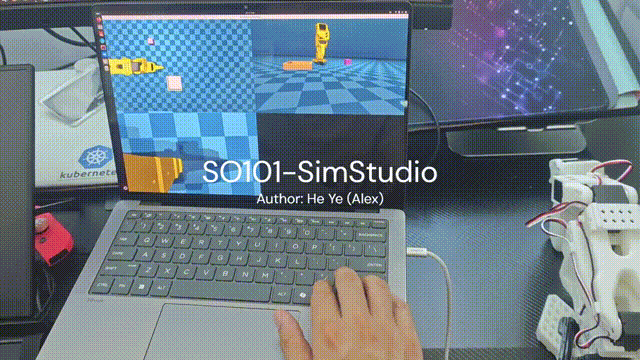
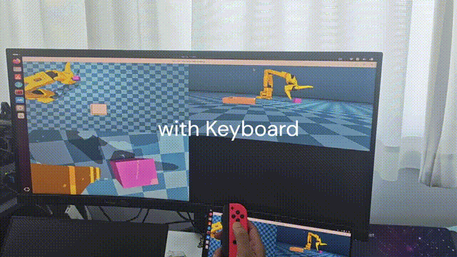
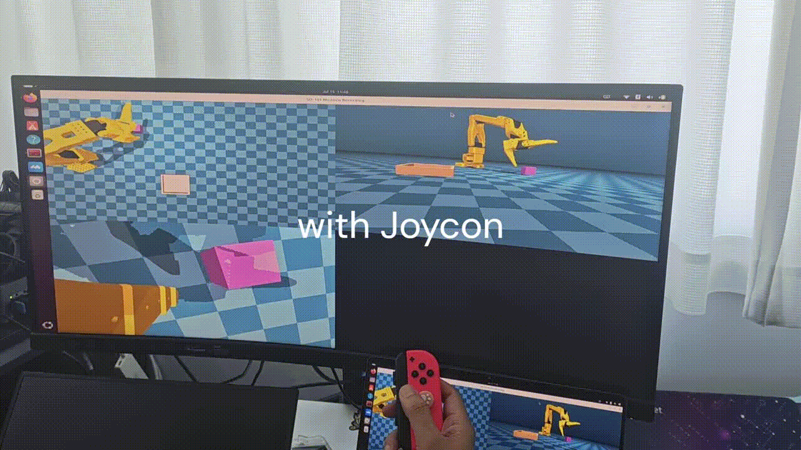
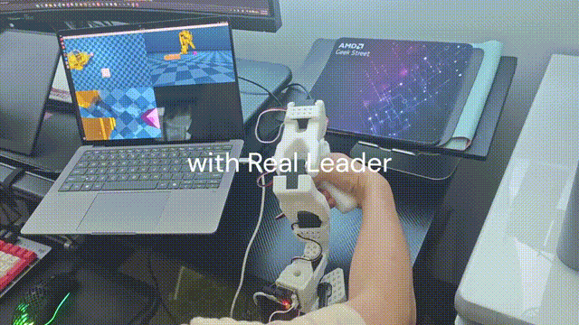
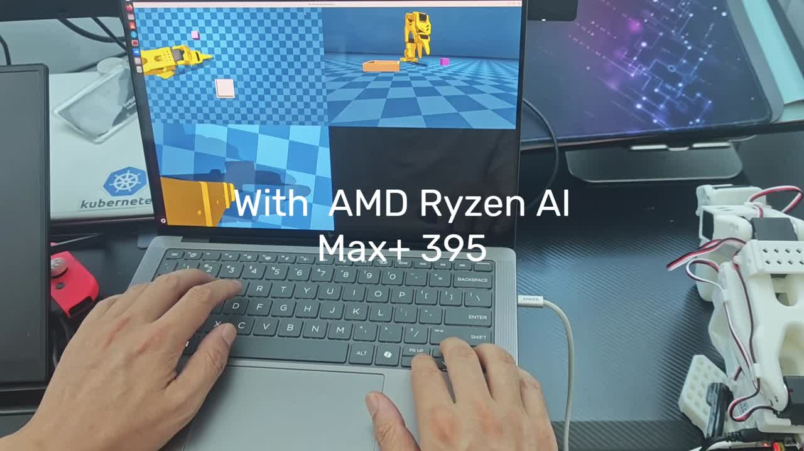
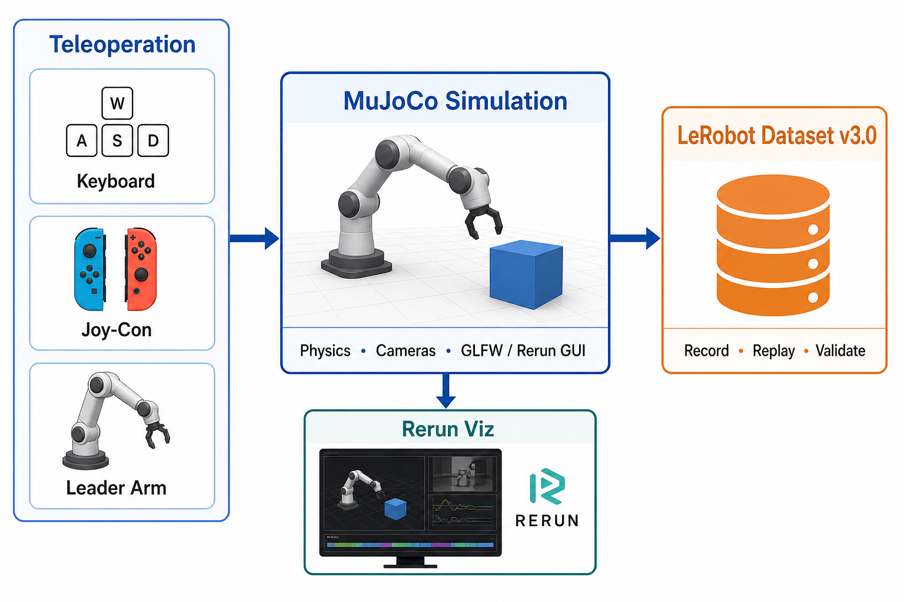

# SO-101 SimStudio：在 AMD ROCm 上打开机器人物理 AI 之门

> SO-101 SimStudio: Opening the Door to Robot Physical AI on AMD ROCm

**语言 / Language:** [中文](#中文) · [English](#english) · ⏱️ ~3 min read

> 📖 想看完整架构、版本清单与复现命令？ → [**技术详解版 / Deep-dive**](README-details.md)



---

## 中文

### 为什么做这个项目

我和很多朋友一样，是从 **SO-101** 和 [**LeRobot**](https://github.com/huggingface/lerobot) 开始物理 AI 和机器人之旅的——这是一套非常好的入门路径：开源硬件、社区活跃、数据集格式清晰，让你很快能「动起来」。

同时我也是 **AMD ROCm** 开发者。仿真对机器人物理 AI 开发同样关键：在真机昂贵、试错成本高的阶段，MuJoCo 这样的物理引擎让你能在 sim 里练遥操作、录示范、验证 pipeline。但 LeRobot 生态里，**面向 ROCm 平台、开箱即用的 SO-101 仿真采集工具**还不多。

[**SO-101 SimStudio**](https://github.com/alexhegit/so101-simstudio) 把这几块技术整合在一起：SO-101 机械臂、MuJoCo 物理仿真、LeRobot v3.0 数据集格式，以及 **ROCm-first** 的环境与文档。目标是让物理 AI 开发者能在 **AMD ROCm** 环境下，从仿真开始学习机器人物理 AI——**只需要一台 AMD Ryzen AI 笔记本或 mini PC**，就能打开这扇门。

> 项目会持续迭代（真机 follower、行为克隆训练等已在 [ROADMAP](https://github.com/alexhegit/so101-simstudio/blob/main/ROADMAP.md)）。本文介绍 **首个稳定 release（v0.1.2）** 的定位与能力。

### v0.1.2 能做什么

| 能力 | 说明 |
| --- | --- |
| **三种遥操作** | 键盘（速度控制）、Joy-Con（柱坐标 reach/swing）、Leader 臂（Feetech STS3215 位置映射） |
| **双录制 GUI** | `--view_mode mujoco`（GLFW 3D，低延迟）或 `rerun`（多相机流，Wayland 友好） |
| **LeRobot v3.0** | 录制、回放、校验、Rerun 可视化；**不改 LeRobot 上游**，通过插件注册接入 |
| **MuJoCo 仿真** | SO-101 6-DOF 臂 + `simple_pick` 桌面抓取场景 + 三路相机 |
| **ROCm 环境** | `make rocm-sync` 一键装依赖；Ubuntu 24.04 + ROCm 7.2.x 为当前支持矩阵 |

### 三种遥操作（Demo 实拍）

v0.1.2 支持三种 teleop，同一套 LeRobot v3.0 录制 pipeline。以下片段来自项目 demo 视频（`SO101-SimStudio-Demo01.mp4`）：

| 键盘 · Keyboard | Joy-Con | Leader 臂 · Leader arm |
| --- | --- | --- |
|  |  |  |
| 世界系速度（WASD） | 柱坐标 reach/swing；单手录制 | Feetech STS3215，1:1 位置映射 |



### 架构一图流

遥操作输入 → Action Mapping → MuJoCo 仿真 → LeRobot 数据集。LeRobot 的 `record` / `replay` 脚本走插件发现（`lerobot_robot_*` / `lerobot_teleoperator_*`），SimStudio 只实现 robot 与 teleop 层，保持 submodule 干净。



### 从哪里开始

**新读者请从项目的 [QUICKSTART.md](https://github.com/alexhegit/so101-simstudio/blob/main/QUICKSTART.md) 入手**——安装、smoke 检查、三种遥操作的录制命令都在那里。

最短路径：

```bash
git clone --recursive https://github.com/alexhegit/so101-simstudio.git
cd so101-simstudio
make rocm-sync
source .venv-rocm/bin/activate

python -m simstudio.scripts.record \
    --config configs/so101_mujoco_keyboard.yaml \
    --view_mode mujoco
```

更多文档：[DESIGN.md](https://github.com/alexhegit/so101-simstudio/blob/main/DESIGN.md)（架构）、[ROADMAP.md](https://github.com/alexhegit/so101-simstudio/blob/main/ROADMAP.md)（规划）。

### 鸣谢与实践

SimStudio 站在许多开源项目之上：[LeRobot](https://github.com/huggingface/lerobot)、[MuJoCo](https://github.com/google-deepmind/mujoco)、[The Robot Studio SO-ARM100](https://github.com/TheRobotStudio/SO-ARM100)、[joycon-robotics](https://github.com/box2ai-robotics/joycon-robotics)、[Rerun](https://github.com/rerun-io/rerun) 等。完整列表见项目 [ACKNOWLEDGEMENTS.md](https://github.com/alexhegit/so101-simstudio/blob/main/ACKNOWLEDGEMENTS.md)。

**动手建议：** clone 仓库 → 跑 `make smoke-keyboard-record` → 录 1–2 个 episode → 用 `dataset_viz` 或 replay 脚本回放。欢迎 issue / PR；下一篇 blog 会跟进具体实践与数据质量细节。

- **代码**：[github.com/alexhegit/so101-simstudio](https://github.com/alexhegit/so101-simstudio)
- **技术详解**：[README-details.md](README-details.md)

---

## English

### Why this project

Like many in this community, I started my physical-AI and robotics journey with **SO-101** and [**LeRobot**](https://github.com/huggingface/lerobot) — an excellent on-ramp: open hardware, an active community, and a clear dataset format that gets you moving quickly.

I'm also an **AMD ROCm** developer. Simulation matters just as much for robot physical AI: before you invest in real hardware, MuJoCo-class physics lets you teleoperate, collect demonstrations, and validate pipelines in sim. Yet in the LeRobot ecosystem, **turnkey SO-101 simulation + data collection on ROCm** was still thin on the ground.

[**SO-101 SimStudio**](https://github.com/alexhegit/so101-simstudio) brings the pieces together: the SO-101 arm, MuJoCo physics, LeRobot v3.0 datasets, and a **ROCm-first** setup and docs. The goal is simple — let physical-AI developers learn robot physical AI **from simulation on AMD ROCm**. **An AMD Ryzen AI laptop or mini PC is enough** to open that door.

> The project is actively developed (real follower hardware, behavior-cloning training, and more on the [ROADMAP](https://github.com/alexhegit/so101-simstudio/blob/main/ROADMAP.md)). This post covers the **first stable release (v0.1.2)** — what it is and what it can do today.

### What v0.1.2 offers

| Capability | Notes |
| --- | --- |
| **Three teleop backends** | Keyboard (velocity), Joy-Con (cylindrical reach/swing), leader arm (Feetech STS3215 position mapping) |
| **Dual recording GUI** | `--view_mode mujoco` (GLFW 3D, low latency) or `rerun` (multi-camera stream, Wayland-friendly) |
| **LeRobot v3.0** | Record, replay, validate, Rerun viz — **no upstream LeRobot patches**, plugin registration only |
| **MuJoCo sim** | SO-101 6-DOF arm, `simple_pick` table task, three cameras |
| **ROCm setup** | `make rocm-sync` one-shot deps; Ubuntu 24.04 + ROCm 7.2.x is the supported matrix |

### Three teleop modes (demo footage)

v0.1.2 ships three teleop backends on the same LeRobot v3.0 recording pipeline. Clips from project demo video (`SO101-SimStudio-Demo01.mp4`):

| Keyboard | Joy-Con | Leader arm |
| --- | --- | --- |
|  |  |  |
| World-frame velocity (WASD) | Cylindrical reach/swing; one-handed record | Feetech STS3215, 1:1 position mapping |


### Architecture at a glance

Teleop → action mapping → MuJoCo sim → LeRobot dataset. LeRobot's record/replay scripts discover plugins (`lerobot_robot_*` / `lerobot_teleoperator_*`); SimStudio implements the robot and teleop layers only, keeping the submodule pristine.


### Where to start

**New readers: start with [QUICKSTART.md](https://github.com/alexhegit/so101-simstudio/blob/main/QUICKSTART.md)** — install, smoke checks, and recording commands for all three teleop modes.

Shortest path:

```bash
git clone --recursive https://github.com/alexhegit/so101-simstudio.git
cd so101-simstudio
make rocm-sync
source .venv-rocm/bin/activate

python -m simstudio.scripts.record \
    --config configs/so101_mujoco_keyboard.yaml \
    --view_mode mujoco
```

More docs: [DESIGN.md](https://github.com/alexhegit/so101-simstudio/blob/main/DESIGN.md) (architecture), [ROADMAP.md](https://github.com/alexhegit/so101-simstudio/blob/main/ROADMAP.md) (plans).

### Acknowledgements & practice

SimStudio stands on open source: [LeRobot](https://github.com/huggingface/lerobot), [MuJoCo](https://github.com/google-deepmind/mujoco), [The Robot Studio SO-ARM100](https://github.com/TheRobotStudio/SO-ARM100), [joycon-robotics](https://github.com/box2ai-robotics/joycon-robotics), [Rerun](https://github.com/rerun-io/rerun), and more. See [ACKNOWLEDGEMENTS.md](https://github.com/alexhegit/so101-simstudio/blob/main/ACKNOWLEDGEMENTS.md) in the repo.

**Try it:** clone → run `make smoke-keyboard-record` → record 1–2 episodes → replay with `dataset_viz` or replay scripts. Issues and PRs welcome; follow-up posts will cover hands-on workflows and data quality.

- **Code:** [github.com/alexhegit/so101-simstudio](https://github.com/alexhegit/so101-simstudio)
- **Deep-dive:** [README-details.md](README-details.md)
